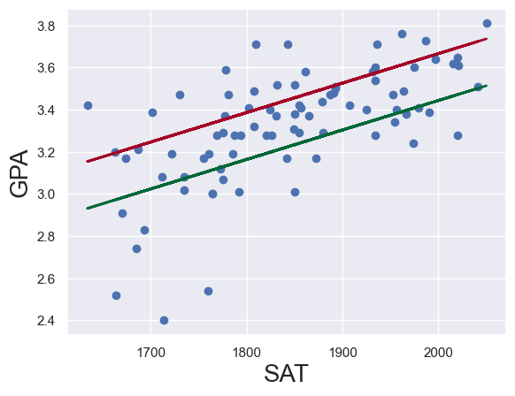
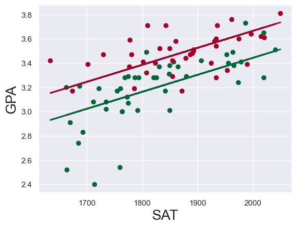
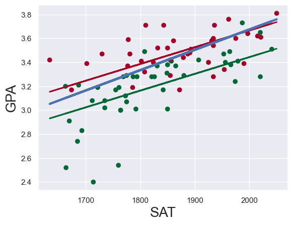

# Dummy variables atau bagaimana bekerja dengan Categorical Predictors

> Pengulangan dan solusi kasus sebelumnya

## Import libraries


```python
import numpy as np
import pandas as pd
import statsmodels.api as sm
import matplotlib.pyplot as plt
import seaborn as sns
sns.set()
```

## Load data


```python
raw_data = pd.read_csv('Dummies.csv')
raw_data
```


<div>
<style scoped>
    .dataframe tbody tr th:only-of-type {
        vertical-align: middle;
    }

    .dataframe tbody tr th {
        vertical-align: top;
    }

    .dataframe thead th {
        text-align: right;
    }
</style>
<table border="1" class="dataframe">
  <thead>
    <tr style="text-align: right;">
      <th></th>
      <th>SAT</th>
      <th>GPA</th>
      <th>Attendance</th>
    </tr>
  </thead>
  <tbody>
    <tr>
      <th>0</th>
      <td>1714</td>
      <td>2.40</td>
      <td>No</td>
    </tr>
    <tr>
      <th>1</th>
      <td>1664</td>
      <td>2.52</td>
      <td>No</td>
    </tr>
    <tr>
      <th>2</th>
      <td>1760</td>
      <td>2.54</td>
      <td>No</td>
    </tr>
    <tr>
      <th>3</th>
      <td>1685</td>
      <td>2.74</td>
      <td>No</td>
    </tr>
    <tr>
      <th>4</th>
      <td>1693</td>
      <td>2.83</td>
      <td>No</td>
    </tr>
    <tr>
      <th>...</th>
      <td>...</td>
      <td>...</td>
      <td>...</td>
    </tr>
    <tr>
      <th>79</th>
      <td>1936</td>
      <td>3.71</td>
      <td>Yes</td>
    </tr>
    <tr>
      <th>80</th>
      <td>1810</td>
      <td>3.71</td>
      <td>Yes</td>
    </tr>
    <tr>
      <th>81</th>
      <td>1987</td>
      <td>3.73</td>
      <td>No</td>
    </tr>
    <tr>
      <th>82</th>
      <td>1962</td>
      <td>3.76</td>
      <td>Yes</td>
    </tr>
    <tr>
      <th>83</th>
      <td>2050</td>
      <td>3.81</td>
      <td>Yes</td>
    </tr>
  </tbody>
</table>
<p>84 rows × 3 columns</p>
</div>


## Map data

Keterangan: Map semua isian 'No' menjadi 0, dan isian 'Yes' menjadi 1. Simpan ke dalam variable 'data'.

Catatan: data adalah hasil 'copy' dari raw_data, karena in cara pointers pada Python bekerja.


```python
data = raw_data.copy()
data['Attendance'] = data['Attendance'].map({'Yes':1, 'No':0})
data
```


<div>
<style scoped>
    .dataframe tbody tr th:only-of-type {
        vertical-align: middle;
    }

    .dataframe tbody tr th {
        vertical-align: top;
    }

    .dataframe thead th {
        text-align: right;
    }
</style>
<table border="1" class="dataframe">
  <thead>
    <tr style="text-align: right;">
      <th></th>
      <th>SAT</th>
      <th>GPA</th>
      <th>Attendance</th>
    </tr>
  </thead>
  <tbody>
    <tr>
      <th>0</th>
      <td>1714</td>
      <td>2.40</td>
      <td>0</td>
    </tr>
    <tr>
      <th>1</th>
      <td>1664</td>
      <td>2.52</td>
      <td>0</td>
    </tr>
    <tr>
      <th>2</th>
      <td>1760</td>
      <td>2.54</td>
      <td>0</td>
    </tr>
    <tr>
      <th>3</th>
      <td>1685</td>
      <td>2.74</td>
      <td>0</td>
    </tr>
    <tr>
      <th>4</th>
      <td>1693</td>
      <td>2.83</td>
      <td>0</td>
    </tr>
    <tr>
      <th>...</th>
      <td>...</td>
      <td>...</td>
      <td>...</td>
    </tr>
    <tr>
      <th>79</th>
      <td>1936</td>
      <td>3.71</td>
      <td>1</td>
    </tr>
    <tr>
      <th>80</th>
      <td>1810</td>
      <td>3.71</td>
      <td>1</td>
    </tr>
    <tr>
      <th>81</th>
      <td>1987</td>
      <td>3.73</td>
      <td>0</td>
    </tr>
    <tr>
      <th>82</th>
      <td>1962</td>
      <td>3.76</td>
      <td>1</td>
    </tr>
    <tr>
      <th>83</th>
      <td>2050</td>
      <td>3.81</td>
      <td>1</td>
    </tr>
  </tbody>
</table>
<p>84 rows × 3 columns</p>
</div>


```python
data.describe()
```


<div>
<style scoped>
    .dataframe tbody tr th:only-of-type {
        vertical-align: middle;
    }

    .dataframe tbody tr th {
        vertical-align: top;
    }

    .dataframe thead th {
        text-align: right;
    }
</style>
<table border="1" class="dataframe">
  <thead>
    <tr style="text-align: right;">
      <th></th>
      <th>SAT</th>
      <th>GPA</th>
      <th>Attendance</th>
    </tr>
  </thead>
  <tbody>
    <tr>
      <th>count</th>
      <td>84.000000</td>
      <td>84.000000</td>
      <td>84.000000</td>
    </tr>
    <tr>
      <th>mean</th>
      <td>1845.273810</td>
      <td>3.330238</td>
      <td>0.464286</td>
    </tr>
    <tr>
      <th>std</th>
      <td>104.530661</td>
      <td>0.271617</td>
      <td>0.501718</td>
    </tr>
    <tr>
      <th>min</th>
      <td>1634.000000</td>
      <td>2.400000</td>
      <td>0.000000</td>
    </tr>
    <tr>
      <th>25%</th>
      <td>1772.000000</td>
      <td>3.190000</td>
      <td>0.000000</td>
    </tr>
    <tr>
      <th>50%</th>
      <td>1846.000000</td>
      <td>3.380000</td>
      <td>0.000000</td>
    </tr>
    <tr>
      <th>75%</th>
      <td>1934.000000</td>
      <td>3.502500</td>
      <td>1.000000</td>
    </tr>
    <tr>
      <th>max</th>
      <td>2050.000000</td>
      <td>3.810000</td>
      <td>1.000000</td>
    </tr>
  </tbody>
</table>
</div>


## Regression

- Dibawah adalah regression equation, dari dependent variable (y) adalah GPA


```python
y = data['GPA']
```

- Sama halnya, independent variable (x) adalah nilat SAT 


```python
x1 = data[['SAT','Attendance']]
```

- Menambahkan constant, pada dasarnya, kita menambahkan column baru (yang panjangnya sama dengan x), yang hanya terdiri dari angka 1.


```python
x = sm.add_constant(x1)
```

- Fit the model, menurut metode OLS (ordinary least squares) dengan variabel dependen y dan variabel independen x


```python
results = sm.OLS(y,x).fit()
```

- Print summary dari regression


```python
results.summary()
```


<table class="simpletable">
<caption>OLS Regression Results</caption>
<tr>
  <th>Dep. Variable:</th>           <td>GPA</td>       <th>  R-squared:         </th> <td>   0.565</td>
</tr>
<tr>
  <th>Model:</th>                   <td>OLS</td>       <th>  Adj. R-squared:    </th> <td>   0.555</td>
</tr>
<tr>
  <th>Method:</th>             <td>Least Squares</td>  <th>  F-statistic:       </th> <td>   52.70</td>
</tr>
<tr>
  <th>Date:</th>             <td>Wed, 18 Dec 2024</td> <th>  Prob (F-statistic):</th> <td>2.19e-15</td>
</tr>
<tr>
  <th>Time:</th>                 <td>18:13:58</td>     <th>  Log-Likelihood:    </th> <td>  25.798</td>
</tr>
<tr>
  <th>No. Observations:</th>      <td>    84</td>      <th>  AIC:               </th> <td>  -45.60</td>
</tr>
<tr>
  <th>Df Residuals:</th>          <td>    81</td>      <th>  BIC:               </th> <td>  -38.30</td>
</tr>
<tr>
  <th>Df Model:</th>              <td>     2</td>      <th>                     </th>     <td> </td>   
</tr>
<tr>
  <th>Covariance Type:</th>      <td>nonrobust</td>    <th>                     </th>     <td> </td>   
</tr>
</table>
<table class="simpletable">
<tr>
       <td></td>         <th>coef</th>     <th>std err</th>      <th>t</th>      <th>P>|t|</th>  <th>[0.025</th>    <th>0.975]</th>  
</tr>
<tr>
  <th>const</th>      <td>    0.6439</td> <td>    0.358</td> <td>    1.797</td> <td> 0.076</td> <td>   -0.069</td> <td>    1.357</td>
</tr>
<tr>
  <th>SAT</th>        <td>    0.0014</td> <td>    0.000</td> <td>    7.141</td> <td> 0.000</td> <td>    0.001</td> <td>    0.002</td>
</tr>
<tr>
  <th>Attendance</th> <td>    0.2226</td> <td>    0.041</td> <td>    5.451</td> <td> 0.000</td> <td>    0.141</td> <td>    0.304</td>
</tr>
</table>
<table class="simpletable">
<tr>
  <th>Omnibus:</th>       <td>19.560</td> <th>  Durbin-Watson:     </th> <td>   1.009</td>
</tr>
<tr>
  <th>Prob(Omnibus):</th> <td> 0.000</td> <th>  Jarque-Bera (JB):  </th> <td>  27.189</td>
</tr>
<tr>
  <th>Skew:</th>          <td>-1.028</td> <th>  Prob(JB):          </th> <td>1.25e-06</td>
</tr>
<tr>
  <th>Kurtosis:</th>      <td> 4.881</td> <th>  Cond. No.          </th> <td>3.35e+04</td>
</tr>
</table><br/><br/>Notes:<br/>[1] Standard Errors assume that the covariance matrix of the errors is correctly specified.<br/>[2] The condition number is large, 3.35e+04. This might indicate that there are<br/>strong multicollinearity or other numerical problems.


### Cara membaca hasil regresi OLS (Ordinary Least Squares) diatas:

1. Informasi Umum
- Dep. Variable (Variabel Dependen): GPA (Grade Point Average) adalah variabel yang ingin Anda prediksi.
- Model: OLS menunjukkan bahwa metode yang digunakan adalah Ordinary Least Squares.
- No. Observations (Jumlah Observasi): 84 menunjukkan jumlah data yang digunakan dalam analisis.
- Covariance Type: nonrobust menunjukkan bahwa jenis kovarians yang digunakan tidak robust.
  
2. Statistik Model
- R-squared: 0.565 menunjukkan bahwa sekitar 56.5% variasi dalam GPA dapat dijelaskan oleh model ini.
- Adj. R-squared: 0.555 adalah R-squared yang disesuaikan untuk jumlah variabel dalam model, menunjukkan seberapa baik model menjelaskan data dengan mempertimbangkan jumlah variabel.
- F-statistic: 52.70 adalah statistik F yang digunakan untuk menguji signifikansi model secara keseluruhan.
- Prob (F-statistic): 2.19e-15 menunjukkan nilai p yang sangat kecil, yang berarti model secara keseluruhan signifikan.

3. Koefisien Regresi
Bagian ini menunjukkan koefisien untuk setiap variabel dalam model:

- const (Intercept): 0.6439 adalah nilai intercept dari model. Ini adalah nilai GPA ketika semua variabel independen sama dengan nol.
- SAT: 0.0014 menunjukkan bahwa setiap peningkatan satu poin dalam skor SAT diharapkan meningkatkan GPA sebesar 0.0014, dengan nilai p (P>|t|) 0.000 yang menunjukkan signifikansi yang sangat tinggi.
- Attendance: 0.2226 menunjukkan bahwa setiap peningkatan satu unit dalam kehadiran diharapkan meningkatkan GPA sebesar 0.2226, juga dengan nilai p 0.000 yang menunjukkan signifikansi yang sangat tinggi.

4. Statistik Uji
- std err (Standard Error): Menunjukkan ketidakpastian dalam estimasi koefisien.
- t: Statistik t untuk menguji signifikansi koefisien.
- P>|t|: Nilai p untuk menguji hipotesis nol bahwa koefisien sama dengan nol. Nilai p yang lebih kecil dari 0.05 biasanya dianggap signifikan.

5. Statistik Diagnostik
- Omnibus: 19.560 adalah tes untuk normalitas residual.
- Prob(Omnibus): 0.000 menunjukkan bahwa residual tidak terdistribusi normal.
- Durbin-Watson: 1.009 adalah tes untuk autokorelasi residual. Nilai mendekati 2 menunjukkan tidak ada autokorelasi.
- Skew: -1.028 menunjukkan bahwa distribusi residual miring ke kiri.
- Kurtosis: 4.881 menunjukkan bahwa distribusi residual lebih tajam dibandingkan distribusi normal.

6. Kriteria Informasi
- AIC (Akaike Information Criterion): -45.60 dan BIC (Bayesian Information Criterion): -38.30 adalah kriteria untuk membandingkan model. Nilai yang lebih rendah menunjukkan model yang lebih baik.

**Kesimpulan:**
Hasil regresi menunjukkan bahwa model yang digunakan cukup baik dalam menjelaskan variasi GPA, dengan variabel SAT dan Attendance yang signifikan mempengaruhi GPA. Namun, ada indikasi bahwa residual tidak terdistribusi normal, yang mungkin perlu diperhatikan dalam analisis lebih lanjut.

## Plot regression line pada scatter plot


```python
# Membuat scatter plot dari SAT dan GPA
plt.scatter(data['SAT'],y)

# Define 2 regression equations, tergantung dari cuaca kehadiran (attendance) student (yes) atau (no)
yhat_no =  0.6439 + 0.0014*data['SAT']
yhat_yes = 0.8665 + 0.0014*data['SAT']

# Plot 2 regression lines
fig = plt.plot(data['SAT'], yhat_no, lw=2, c='#006837')
fit = plt.plot(data['SAT'], yhat_yes, lw=2, c='#a50026')

# Memberi nama sumbu axes (x dan y)
plt.xlabel('SAT', fontsize=20)
plt.ylabel('GPA', fontsize=20)
plt.show()
```


    

    


## Plot regression line pada scatter plot dan warnai data point

Pada kode ini kita ingin memberikan warna data berdasarkan attendance student
**Catatan**: Akan mudah dengan mudah dengan menggunakan Seaborn

- Buat sebuah scatter plot yang memuat semua observasi
- Gunakan series Attendance dengan warna, dan pilih warna sesuai dengan keinginan anda
- Peta warna yang telah kami pilih sepenuhnya bersifat bebas.
- Define 2 regression equations (1 dengan dummy=1, dan lainnya dengan dummy=0)
- Kita sudah membuatnya diatas, tapi untuk menjaga konsistensi, kita juga akan memasukkannya disini


```python
yhat_no = 0.6439 + 0.0014*data['SAT']
yhat_yes = 0.8665 + 0.0014*data['SAT']

# Plot 2 regression line
plt.scatter(data['SAT'], data['GPA'], c=data['Attendance'], cmap='RdYlGn_r')
fig = plt.plot(data['SAT'], yhat_no, lw=2, c='#006837')
fig = plt.plot(data['SAT'], yhat_yes, lw=2, c='#a50026')

plt.xlabel('SAT', fontsize=20)
plt.ylabel('GPA', fontsize=20)
plt.show()
```


    

    


## Tambahkan original regression line menjadi 1 plot


```python
# Sama seperti diatas, kali ini kita menyertakan regression line tanpa dummies.

# Catatan: Kode ini akan sangat mudah dilakukan di Seaborn
# Buat satu plot sebar yang berisi semua observasi
# Gunakan seri 'Attendance' sebagai warna, dan pilih peta warna sesuai pilihan Anda
# Peta warna yang telah kami pilih sepenuhnya bersifat bebas
plt.scatter(data['SAT'], data['GPA'], c=data['Attendance'], cmap='RdYlGn_r')

# Define 2 regression equations (1 dengan dummy=1, dan lainnya dummy=0)
# Kita sudah membuatnya diatas, tapi untuk menjaga konsistensi, kita juga akan memasukkannya disini
yhat_no = 0.6439 + 0.0014*data['SAT']
yhat_yes = 0.8665 + 0.0014*data['SAT']
# Original regression line
yhat = 0.0017*data['SAT'] + 0.275

# Plot 2 buah regression line
fig = plt.plot(data['SAT'], yhat_no, lw=2, c='#006837', label = 'regression line1')
fig = plt.plot(data['SAT'], yhat_yes, lw=2, c='#a50026', label = 'regression line2')
# Plot original regression line
fig = plt.plot(data['SAT'], yhat, lw=3, c='#4C72B0', label = 'regression line ORI!')

plt.xlabel('SAT', fontsize=20)
plt.ylabel('GPA', fontsize=20)
plt.show()
```


    

    


## Bagaimana membuat prediksi berdasarkan regression yang sudah kita buat.


```python
# Mari kita lihat apa yang ada di dalam variabel independen. 
# Kolom pertama berasal dari metode 'add_constant'. Itu hanya berisi angka 1
x
```


<div>
<style scoped>
    .dataframe tbody tr th:only-of-type {
        vertical-align: middle;
    }

    .dataframe tbody tr th {
        vertical-align: top;
    }

    .dataframe thead th {
        text-align: right;
    }
</style>
<table border="1" class="dataframe">
  <thead>
    <tr style="text-align: right;">
      <th></th>
      <th>const</th>
      <th>SAT</th>
      <th>Attendance</th>
    </tr>
  </thead>
  <tbody>
    <tr>
      <th>0</th>
      <td>1.0</td>
      <td>1714</td>
      <td>0</td>
    </tr>
    <tr>
      <th>1</th>
      <td>1.0</td>
      <td>1664</td>
      <td>0</td>
    </tr>
    <tr>
      <th>2</th>
      <td>1.0</td>
      <td>1760</td>
      <td>0</td>
    </tr>
    <tr>
      <th>3</th>
      <td>1.0</td>
      <td>1685</td>
      <td>0</td>
    </tr>
    <tr>
      <th>4</th>
      <td>1.0</td>
      <td>1693</td>
      <td>0</td>
    </tr>
    <tr>
      <th>...</th>
      <td>...</td>
      <td>...</td>
      <td>...</td>
    </tr>
    <tr>
      <th>79</th>
      <td>1.0</td>
      <td>1936</td>
      <td>1</td>
    </tr>
    <tr>
      <th>80</th>
      <td>1.0</td>
      <td>1810</td>
      <td>1</td>
    </tr>
    <tr>
      <th>81</th>
      <td>1.0</td>
      <td>1987</td>
      <td>0</td>
    </tr>
    <tr>
      <th>82</th>
      <td>1.0</td>
      <td>1962</td>
      <td>1</td>
    </tr>
    <tr>
      <th>83</th>
      <td>1.0</td>
      <td>2050</td>
      <td>1</td>
    </tr>
  </tbody>
</table>
<p>84 rows × 3 columns</p>
</div>


```python
# Buatlah sebuah data frame baru yang identik dalam organisasi dengan X. 
# Konstanta selalu 1, sementara setiap barisnya sesuai dengan sebuah observasi (siswa).
new_data = pd.DataFrame({'const':1, 'SAT':[1700,1670], 'Attendance':[0,1]})

# Secara default, ketika Anda membuat sebuah df (bukan memuat, tetapi membuat), kolom-kolomnya diurutkan secara alfabetis. 
# Jadi jika kita tidak mengurutkannya kembali, kolom-kolomnya akan menjadi 'Attendance', 'const', 'SAT'. 
# Jika Anda memasukkannya dalam urutan yang salah, Anda akan mendapatkan hasil yang salah!
new_data = new_data[['const','SAT','Attendance']]
new_data
```


<div>
<style scoped>
    .dataframe tbody tr th:only-of-type {
        vertical-align: middle;
    }

    .dataframe tbody tr th {
        vertical-align: top;
    }

    .dataframe thead th {
        text-align: right;
    }
</style>
<table border="1" class="dataframe">
  <thead>
    <tr style="text-align: right;">
      <th></th>
      <th>const</th>
      <th>SAT</th>
      <th>Attendance</th>
    </tr>
  </thead>
  <tbody>
    <tr>
      <th>0</th>
      <td>1</td>
      <td>1700</td>
      <td>0</td>
    </tr>
    <tr>
      <th>1</th>
      <td>1</td>
      <td>1670</td>
      <td>1</td>
    </tr>
  </tbody>
</table>
</div>


```python
# Saya sedang mengganti nama indeks untuk keperluan contoh ini. 
# Itu sebenarnya bukan praktik yang baik => Saya tidak akan menimpa variabel tersebut. 
# Jika saya ingin menggunakan metode NumPy, sklearn, dll. pada df dengan indeks yang telah diganti namanya, indeks tersebut akan hilang 
# dan kembali ke 0, 1, 2, 3, dan seterusnya.
new_data.rename(index={0:'Bob', 1:'Alice'})
```


<div>
<style scoped>
    .dataframe tbody tr th:only-of-type {
        vertical-align: middle;
    }

    .dataframe tbody tr th {
        vertical-align: top;
    }

    .dataframe thead th {
        text-align: right;
    }
</style>
<table border="1" class="dataframe">
  <thead>
    <tr style="text-align: right;">
      <th></th>
      <th>const</th>
      <th>SAT</th>
      <th>Attendance</th>
    </tr>
  </thead>
  <tbody>
    <tr>
      <th>Bob</th>
      <td>1</td>
      <td>1700</td>
      <td>0</td>
    </tr>
    <tr>
      <th>Alice</th>
      <td>1</td>
      <td>1670</td>
      <td>1</td>
    </tr>
  </tbody>
</table>
</div>


```python
# Menggunakan metode prediksi dalam regression dengan new data sebagai single argument
predictions = results.predict(new_data)
# Hasilnya
predictions
```


    0    3.023513
    1    3.204163
    dtype: float64


```python
# Jika kita ingin membuat data frame, termasuk semuanya
predictiondf = pd.DataFrame({'Predictions':predictions})

# Join 2 data frame
joined = new_data.join(predictiondf)

# Merubah nama indices as before (not a good practise in general)
joined.rename(index={0:'Bob', 1:'Alice'})
```


<div>
<style scoped>
    .dataframe tbody tr th:only-of-type {
        vertical-align: middle;
    }

    .dataframe tbody tr th {
        vertical-align: top;
    }

    .dataframe thead th {
        text-align: right;
    }
</style>
<table border="1" class="dataframe">
  <thead>
    <tr style="text-align: right;">
      <th></th>
      <th>const</th>
      <th>SAT</th>
      <th>Attendance</th>
      <th>Predictions</th>
    </tr>
  </thead>
  <tbody>
    <tr>
      <th>Bob</th>
      <td>1</td>
      <td>1700</td>
      <td>0</td>
      <td>3.023513</td>
    </tr>
    <tr>
      <th>Alice</th>
      <td>1</td>
      <td>1670</td>
      <td>1</td>
      <td>3.204163</td>
    </tr>
  </tbody>
</table>
</div>


```python

```
